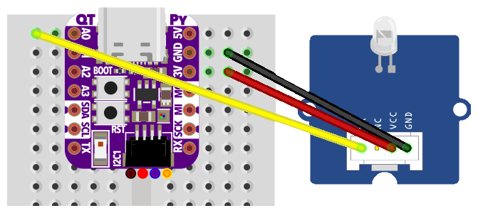
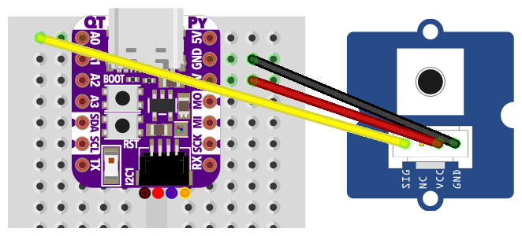
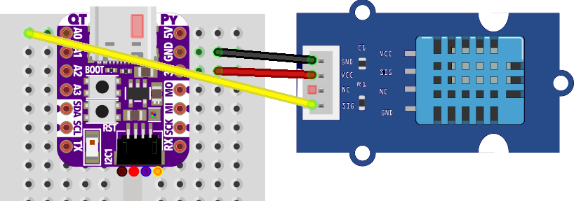

# IoT Embedded Programming with CircuitPython

## Workshop
The Internet of Things ([IoT](http://www.tamberg.org/fhnw/2021/hs/IoT01Introduction.pdf)) is the convergence of internet and real world. IoT embedded devices typically have limited resources, but they are also becoming more performant with each generation. This allows an interpreted language like Python, which is less efficient but more convenient than C, to run on a microcontroller.

### Topics
- [Introduction](#introduction)
- [Toolchain Setup](#toolchain-setup)
- [Hardware Setup](#hardware-setup)
- [GPIO & Sensors](#gpio--sensors)
- [Wi-Fi, HTTP & MQTT](#wifi--http--mqtt)

### Objective
This workshop teaches the basics of embedded programming on the latest IoT hardware, with CircuitPython.

### Target audience
This workshop is aimed at interested people with basic programming experience in Python.

### Prerequisites
Participants need a laptop with MacOS, Windows or Linux, and two USB/USB-C ports. IoT hardware including sensors is available on loan.

The workshop requires a Wi-Fi network that is accessible without a portal. Alternatively, a personal smartphone can be used as a hotspot.

## Introduction
### CircuitPython
> The easiest way to program microcontrollers

https://circuitpython.org/

## Toolchain setup
### Text Editor
CircuitPython works with any text editor, e.g. [Mu Editor](https://codewith.mu/), [VS Code](https://code.visualstudio.com/), or *nano*.

### Serial Monitor
To see output you'll need a serial monitor like [PuTTY](https://www.putty.org/) on Windows or *screen* on MacOS, Linux.

### CircuitPython Libraries
Download the CircuitPython library bundle ZIP file from https://circuitpython.org/libraries

You will selectively copy files from the ZIP to your microcontroller later on.

## Hardware Setup
### Boards
* [ESP32-S2](#esp32-s2)

### ESP32-S2
#### Buy
https://www.adafruit.com/product/5325 (Adafruit QT Py ESP32-S2 WiFi Dev Board)

#### Board
https://circuitpython.org/board/adafruit_qtpy_esp32s2/

#### ESP32-S2 ROM bootloader mode (once)
To get the ESP32-S2 into [ROM bootloader mode](https://learn.adafruit.com/adafruit-qt-py-esp32-s2/pinouts#buttons-3107929)

* Press and hold the _BOOT_ button
* Then, press the _RESET_ button
* Release the _BOOT_ button

Now the board should show up as a USB device, e.g. /dev/cu.usbmodem01 on MacOS or COM3 on Windows.

#### Install UF2 Bootloader (once)
To install the UF2 bootloader, follow the steps to _Install, Repair, or Update UF2 Bootloader_ at the bottom of https://circuitpython.org/board/adafruit_qtpy_esp32s2/

Use https://nabucasa.github.io/esp-web-flasher/ with _combined.bin_ from [tinyuf2-adafruit_qtpy_esp32s2-0.10.2.zip](https://github.com/adafruit/tinyuf2/releases/download/0.10.2/tinyuf2-adafruit_qtpy_esp32s2-0.10.2.zip)

Now press _RESET_ to make the board show up as a USB drive named _QTPYS2BOOT_.

#### Install CircuitPython (once)
Download the board specific .UF2 file from https://circuitpython.org/board/adafruit_qtpy_esp32s2/

Drop it on the USB drive named _QTPYS2BOOT_ and wait until the drive disconnects.

Now the board should show up as a USB drive named _CIRCUITPY_.

#### Install your Python code
Plug in your board via USB and open the _CIRCUITPY_ drive.

Copy required libraries from the bundle to the lib folder.

Copy your code to a file named code.py on the drive.

#### Pinout


* https://learn.adafruit.com/assets/107493 (Pinout)
* https://learn.adafruit.com/adafruit-qt-py-esp32-s2/pinouts

#### Schematic


* https://learn.adafruit.com/assets/110384 (Schematic)
* https://learn.adafruit.com/adafruit-qt-py-esp32-s2/downloads
* https://github.com/adafruit/Adafruit-QT-Py-ESP32-S2-PCB

#### Datasheets
* [ESP32-S2 Series Datasheet](https://www.espressif.com/sites/default/files/documentation/esp32-s2_datasheet_en.pdf)
* [ESP32-S2 Technical Reference Manual](https://www.espressif.com/sites/default/files/documentation/esp32-s2_technical_reference_manual_en.pdf)
* [ESP32-S2 WROVER Technical Reference Manual](https://cdn-learn.adafruit.com/assets/assets/000/096/707/original/esp32-s2-wrover_esp32-s2-wrover-i_datasheet_en.pdf)

## GPIO & sensors
### Blink (digital output)


```
/CIRCUITPY
└── code.py # copied from below
```

```
import board
import digitalio
import time

actuator = digitalio.DigitalInOut(board.D18)
actuator.direction = digitalio.Direction.OUTPUT

while True:
    actuator.value = True
    time.sleep(1)
    actuator.value = False
    time.sleep(1)
```

### Button (digital input)


```
/CIRCUITPY
└── code.py # copied from below
```

```
import board
import digitalio
import time

sensor = digitalio.DigitalInOut(board.D18)
sensor.direction = digitalio.Direction.INPUT
sensor.pull = digitalio.Pull.UP

while True:
    print(sensor.value)
    time.sleep(0.1)
```
### DHT11 temperature & humidity


```
/CIRCUITPY
├── code.py # copied from below
└── lib # libraries from bundle
    └── adafruit_dht.mpy
```

```
import adafruit_dht
import board
import time

sensor = adafruit_dht.DHT11(board.D18)

while True:
    try:
        temp = sensor.temperature
        humi = sensor.humidity
        print("{:.2f} °C, {:.2f} %".format(temp, humi))

    except RuntimeError as e:
        print("Oops, reading the sensor did not work.")

    time.sleep(5)
```

### More
Search the [library bundle docs](https://docs.circuitpython.org/projects/bundle/en/latest/drivers.html) for a sensor or actuator name.

## Wi-Fi, HTTP & MQTT
### Wi-Fi connect
```
/CIRCUITPY
├── code.py # copied from below
└── lib # libraries from bundle
    └── TODO
```

```
import wifi

WIFI_SSID = "MY_SSID" # TODO
WIFI_PASS = "MY_PASSWORD" # TODO

print("Connecting to Wi-Fi \"{0}\"...".format(WIFI_SSID))
wifi.radio.connect(WIFI_SSID, WIFI_PASS) # waits for IP address
print("Connected, IP address = {0}".format(wifi.radio.ipv4_address))
```

### HTTP post
```
/CIRCUITPY
├── code.py # copied from below
└── lib # libraries from bundle
    └── TODO
```

```
import ssl
import time
import wifi
import socketpool

import adafruit_requests

WIFI_SSID = "MY_SSID" # TODO
WIFI_PASS = "MY_PASSWORD" # TODO
CLOUD_KEY = "..." # TODO, ThingSpeak Write API Key
CLOUD_URL = "https://api.thingspeak.com/update?api_key={0}".format(CLOUD_KEY)

print("Connecting to Wi-Fi \"{0}\"...".format(WIFI_SSID))
wifi.radio.connect(WIFI_SSID, WIFI_PASS) # waits for IP address, reconnects automatically
print("Connected, IP address = {0}".format(wifi.radio.ipv4_address))

socket = socketpool.SocketPool(wifi.radio)
context = ssl.create_default_context()
https = adafruit_requests.Session(socket, context)

while True:
    value = 23.0 # e.g. from sensor
    json_data = { "field1": value }
    print("{0}\n\n{1}".format(CLOUD_URL, json_data))
    response = https.post(CLOUD_URL, json=json_data)
    print(response.json())
    time.sleep(30) # s
```

### MQTT publish
```
/CIRCUITPY
├── code.py # copied from below
└── lib # libraries from bundle
    └── TODO
```

```
TODO
```
